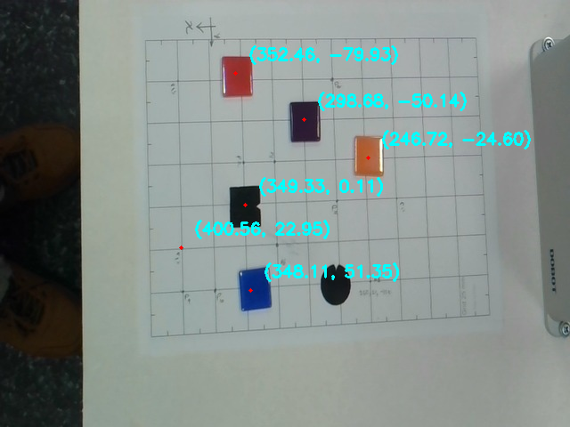

# Calibration

## Team Members:

Kush Patel, Achal Thapa

## GitHub Repo: https://github.com/codekush123/robot_calibration

## Introduction

The main goal of this lab is to establish a 2D mapping between camera image coordinates (pixels) and robot base coordinates (X, Y in millimeters) on a flat table. This mapping allows positions detected in a camera image to be converted into robot coordinates that can be used for pick-and-place tasks.

## Setup and Context

We aligned a 25mm grid pattern with the robot's movement axes using Dobot Studio. By moving the robot between specific coordinates (e.g.,
X = 350 to X = 250), we ensured the grid lines were parallel to the robot's X and Y frames before fixing the paper with tape.

use:

- Dobot MG400
- Camera
- Python
- OpenCV

In this Lab we treat the camera as a "black box" that gives us images and we apply mapping from pixels to robot XY on table.

After setting up the camera. then we checked through DobotStudio that the arm is perfectly aligned to the grids while moving in X and Y. We took initial point at X = 350 mm and then took 5 more coodinates to perform robot calibration.

The calibrated points are as follows:

| Point ID | Robot X (mm) | Robot Y (mm) | Pixel u (px) | Pixel v (px) |
| -------- | ------------ | ------------ | ------------ | ------------ |
| P1       | 350          | 0            | 274          | 229          |
| P2       | 250          | 50           | 416          | 312          |
| P3       | 275          | -75          | 371          | 88           |
| P4       | 400          | 50           | 206          | 330          |
| P5       | 325          | -25          | 307          | 182          |
| P6       | 275          | 0            | 377          | 224          |

## Robot Mapping

We utilized a Homography transformation (3 x 3 matrix). Unlike a simple affine transform, homography accounts for perspective distortion, which occurs if the camera is not perfectly perpendicular to the workspace.
Then we compute a homography using OpenCV's cv2.findHomography() function.

Homography Matrix H:

            [[-7.49793108e-01  5.21688305e-02  5.27306712e+02]
            [ 3.10578166e-02  5.09611906e-01 -1.25650504e+02]
            [-2.22025422e-04  6.36760971e-05  1.00000000e+00]]

This function was implemented to convert pixel coordinates into robot coordinates by multiplying with the homography matrix and normalizing the result.

To making sure that the error is under 1mm, We've done a validation testing where we took one random coordinates and calculate the difference between actual and predicted value of the coordinate. We also calculate the maximum error among all other coordinates and it's 0.45 mm.

## Final Test

We implemented an interactive test using an OpenCV mouse callback. Clicking any point on the image calculates and displays the predicted robot coordinates in real-time.

## Discussion

The most time-consuming part of this lab was to setup the DobotMg400 to setup the grid paper alighment because DobotStudio required several small adjustments. Then we face challenges taking the coordinates especially the robot moved farther away from the initial coordinates.

During pixel selection, we observed that even a one-pixel mis click could introduce an error of approximately 0.5 mm to 1.0 mm in the robot workspace. Because of this sensitivity, we switched to a zoomed-in view of the calibration image to ensure that each click was placed exactly at the center of the grid intersection. Taking extra time at this stage significantly improved overall accuracy.

We observed large errors but less than 1mm on edges which is most likely caused by radial lens distortion. the maximum error of 0.37 mm is well below the 2.0 mm tolerance requirement, so the homography approach is sufficient for this application.

An automatic detection then applying methods like blob detection or converting the image into HSV as discussed in the Lecture 5 and using TCP/IP to send coordinates to robot would help making pick and place concept forward by reduce human error, improve repeatability and allow much faster recalibration if the camera or workshop position changes.
